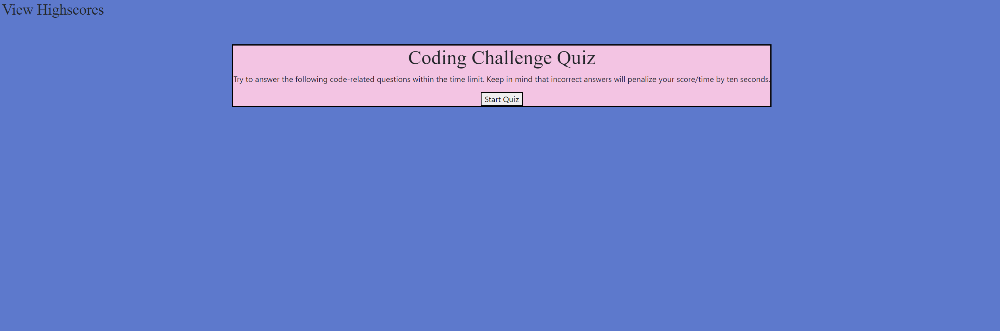
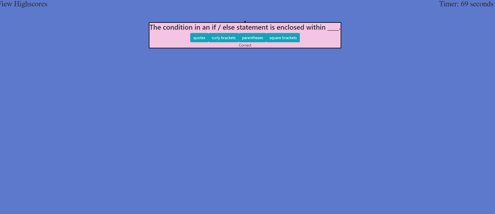
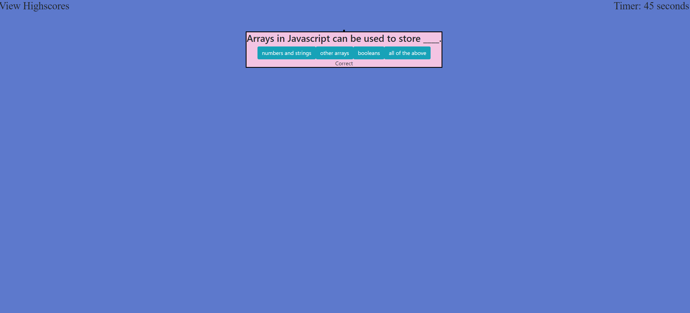
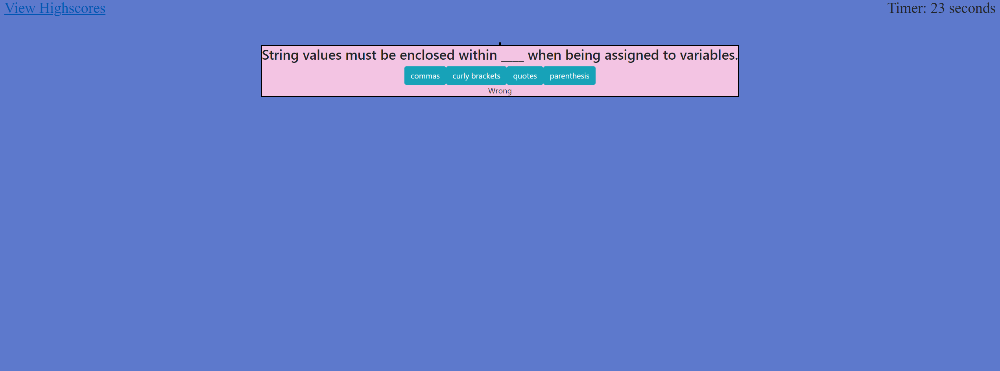
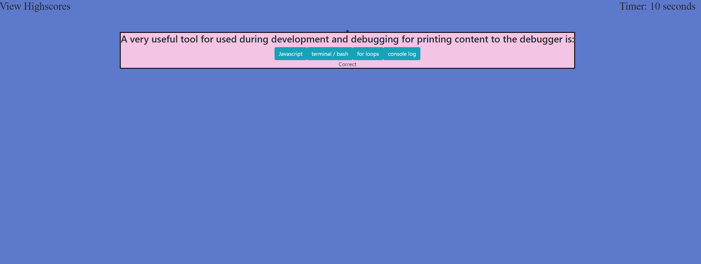
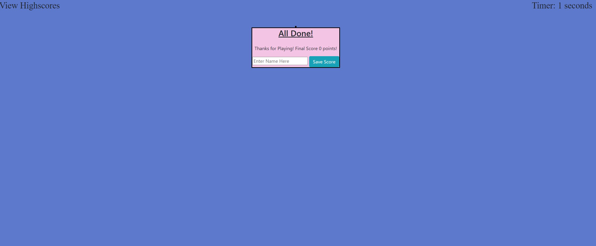
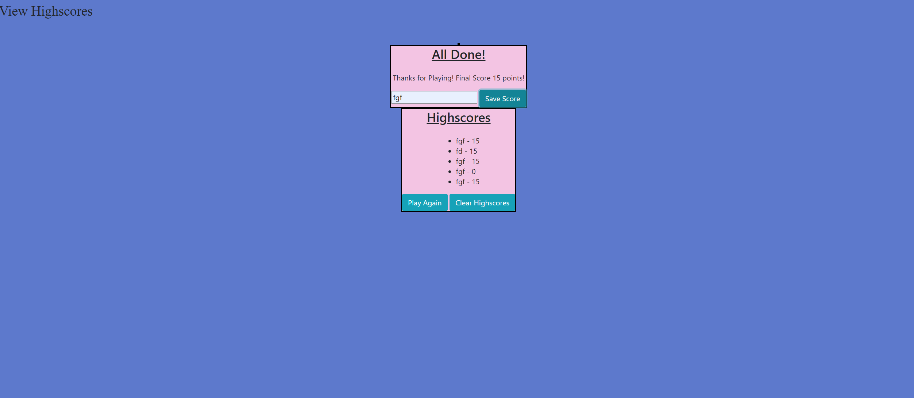

When designing this program I would aiming to meet all necessary criteria while utilizing the code we have learned while covering Javascript. Also, wanted to generate something what would be easy for the user to understand how the program worked and users were able to successfully play the game

It solves the problem of of allowing a user to play a coding quiz game. The user can also save their scores and review them at any time. 

This was a difficult process for me. Psuedocode become my friend. Laying out the foundation of each indiviudal step and then testing to ensure it works, was a life saver. Once I pealed back the layers and used this process the program coded much easier.

Some screen shots of the program,

Main Page User See at Load:

First Question After user selects start game

Second Question After user selects start game, also alerts user of corret/wrong for previous question.

Third Question

Fourth Question

Fifth Question

Game Over Screen User sees after running out of time or answering al of the questions

Highscores showing after user enters score or click View Highscores button

url: https://jmak21203.github.io/CodeQuiz/